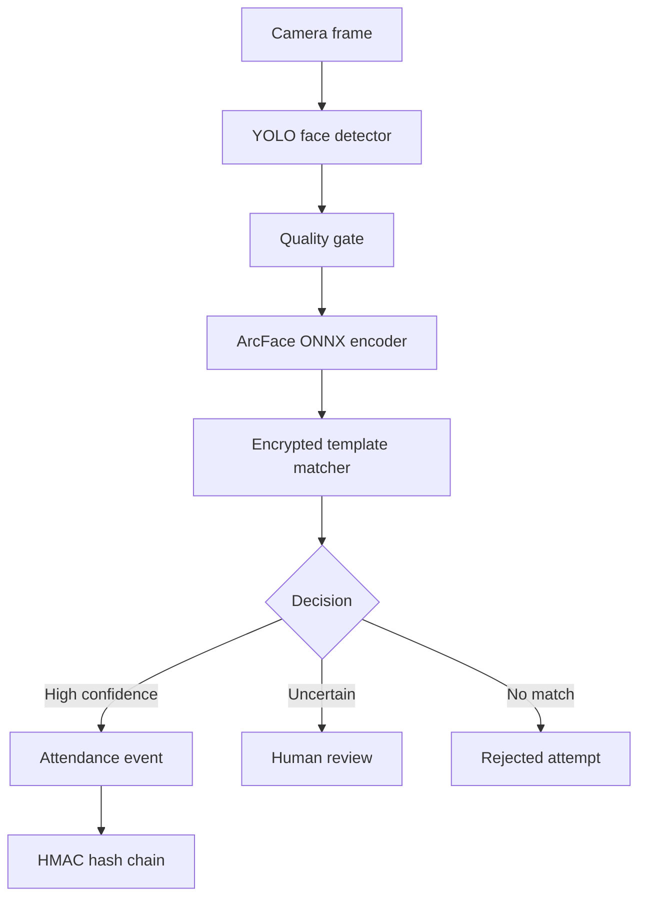

# FaceClock YOLO

FaceClock YOLO is a privacy-first reference system for employee clock-in and clock-out verification through an establishment camera. It combines YOLO face detection, an ArcFace-compatible ONNX encoder, encrypted biometric templates, similarity-based matching, and a tamper-evident attendance ledger.

## Highlights

- YOLO-based single-face detection
- ArcFace-compatible 512-dimensional embeddings
- AES-256-GCM encryption at rest with per-template nonces
- No raw enrollment or recognition images stored
- Explicit biometric consent during enrollment
- Separate accepted, rejected, and human-review decisions
- HMAC-SHA256 chained attendance events
- API-key authentication and per-IP rate limiting
- SQLite by default with SQLAlchemy portability
- Docker and automated security tests

## Responsible use

This repository is a technical reference, not a turnkey surveillance product. Employee biometric processing may be regulated by the LGPD, GDPR, BIPA, labor rules, collective agreements, or local law. Obtain informed consent or another valid legal basis, provide a non-biometric attendance alternative, define retention and deletion policies, restrict camera coverage, document access, and complete a privacy impact assessment before deployment.

Recognition output must not be the sole basis for hiring, dismissal, payroll deductions, discipline, or other high-impact employment decisions. Scores between the review and acceptance thresholds are deliberately routed to a human. The included image-quality checks are not a production-grade liveness solution; add a tested anti-spoofing model and supervised fallback before real-world use.

## Architecture



## Requirements

- Python 3.11 or 3.12
- A YOLO face-detection weight file at `models/yolov8n-face.pt`
- An ArcFace-compatible ONNX model at `models/arcface_w600k_r50.onnx`
- A long random API key and encryption key

Model weights are intentionally excluded. Review their source, license, provenance, demographic performance, and checksum before use.

## Setup

```bash
python -m venv .venv
source .venv/bin/activate
pip install -e '.[dev]'
cp .env.example .env
python -c "from cryptography.fernet import Fernet; print(Fernet.generate_key().decode())"
uvicorn app.main:app --reload
```

Open `http://localhost:8000/docs` for the interactive API documentation.

## Docker

```bash
cp .env.example .env
docker compose up --build
```

## Enrollment

Enrollment requires three to eight images of one consenting employee. Use different head angles and lighting conditions.

```bash
curl -X POST http://localhost:8000/v1/employees/enroll \
  -H "X-API-Key: $FACECLOCK_API_KEY" \
  -F "external_id=EMP-001" \
  -F "display_name=Alex Morgan" \
  -F "consent=true" \
  -F "images=@front.jpg" \
  -F "images=@left.jpg" \
  -F "images=@right.jpg"
```

## Clock in or out

```bash
curl -X POST http://localhost:8000/v1/attendance/recognize \
  -H "X-API-Key: $FACECLOCK_API_KEY" \
  -F "action=clock_in" \
  -F "camera_id=front-desk-01" \
  -F "image=@frame.jpg"
```

## Decision policy

| Similarity | Result | Required handling |
|---|---|---|
| At or above `MATCH_THRESHOLD` | Accepted | Record attendance |
| Between review and match thresholds | Review | Confirm with a human |
| Below `REVIEW_THRESHOLD` | Rejected | Offer a non-biometric fallback |

Thresholds are deployment-specific. Calibrate them with representative, consented validation data and measure false-match and false-non-match rates across relevant groups.

## Tests

```bash
pytest
ruff check .
```

## GitHub Achievements

The project name references both the vision model and GitHub's YOLO achievement. Achievements should be earned through genuine repository activity:

- **YOLO:** merge your own pull request without a review.
- **Quickdraw:** close an issue or pull request within five minutes of opening it.
- **Pair Extraordinaire:** merge a pull request containing a valid `Co-authored-by` trailer for a real collaborator who contributed.
- **Starstruck:** another GitHub user must star the repository.

Do not fabricate collaborators, reviews, stars, or alternate accounts. GitHub controls eligibility and award timing.

## License

MIT
